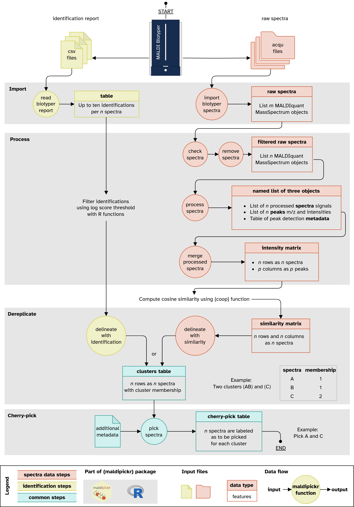

<!-- README.md is generated from README.Rmd. Please edit that file -->

```{r, include = FALSE}
knitr::opts_chunk$set(
  collapse = TRUE,
  comment = "#>",
  fig.path = "man/figures/README-",
  out.width = "100%"
)
```

# maldipickr <a href="https://clavellab.github.io/maldipickr"></a>

<!-- badges: start -->
[](https://CRAN.R-project.org/package=maldipickr)
[](https://www.repostatus.org/#active)
[](https://github.com/ClavelLab/maldipickr/actions/workflows/R-CMD-check.yaml)
[](https://app.codecov.io/github/ClavelLab/maldipickr)
<!-- badges: end -->

* Are you using the MALDI-TOF[^maldi] Biotyper to identify bacterial isolates? **Yes**
* Do you want to select representative isolates for further experiments? **Yes**
* Do you need fast and automated selection decisions that you can retrace? **Yes**

> The [`{maldipickr}`](https://github.com/ClavelLab/maldipickr) package is right for your needs!
> The documented and tested R functions will help you dereplicate MALDI-TOF
> data and cherry-pick representative spectra of microbial isolates.

## Contents

* [Graphical overview](#graphical-overview)
* [Quickstart](#quickstart)
  * [Using spectra data](#using-spectra-data)
  * [Using taxonomic identification report](#using-taxonomic-identification-report)
* [Installation](#installation)
* [Usage](#usage)
* [Acknowledgements](#acknowledgements)
* [References](#references)


## Graphical overview



## Quickstart

How to **cherry-pick bacterial isolates** with MALDI Biotyper:

* [using spectra data](#using-spectra-data)
* [using taxonomic identification report](#using-taxonomic-identification-report)

### Using spectra data

```{r quickstart_spectra}
library(maldipickr)
# Set up the directory location of your spectra data
spectra_dir <- system.file("toy-species-spectra", package = "maldipickr")

# Import and process the spectra
processed <- spectra_dir %>%
  import_biotyper_spectra() %>%
  process_spectra()

# Delineate spectra clusters using Cosine similarity
#  and cherry-pick one representative spectra.
#  The chosen ones are indicated by `to_pick` column
processed %>%
  list() %>%
  merge_processed_spectra() %>%
  coop::tcosine() %>%
  delineate_with_similarity(threshold = 0.92) %>%
  set_reference_spectra(processed$metadata) %>%
  pick_spectra() %>%
  dplyr::relocate(name, to_pick)
```


### Using taxonomic identification report

```{r quickstart_report, eval=TRUE}
library(maldipickr)
# Import Biotyper CSV report
#  and glimpse at the table
report_tbl <- read_biotyper_report(
  system.file("biotyper_unknown.csv", package = "maldipickr")
)
report_tbl %>%
  dplyr::select(name, bruker_species, bruker_log)


# Delineate clusters from the identifications after filtering the reliable ones
#   and cherry-pick one representative spectra.
#   The chosen ones are indicated by `to_pick` column
report_tbl <- report_tbl %>%
  dplyr::mutate(
      bruker_species = dplyr::if_else(bruker_log >= 2, bruker_species,
                                      "not reliable identification")
  )
report_tbl %>%
  delineate_with_identification() %>%
  pick_spectra(report_tbl, criteria_column = "bruker_log") %>%
  dplyr::relocate(name, to_pick, bruker_species)
```


## Installation

`{maldipickr}` is available on the [CRAN](https://cran.r-project.org/package=maldipickr) and on [GitHub](https://github.com/ClavelLab/maldipickr).

To install the latest CRAN release, use the following command in R:

```{r install_cran, eval = FALSE}
install.packages("maldipickr")
```


To install the development version, use the following command in R:

```{r install_github, eval = FALSE}
remotes::install_github("ClavelLab/maldipickr", build_vignettes = TRUE)
```

## Usage

The comprehensive vignettes will walk you through the package functions and showcase how to:

1. [Import spectra data and identification reports from Bruker MALDI Biotyper into R](https://clavellab.github.io/maldipickr/articles/import-data-from-bruker-maldi-biotyper.html).
2. [Process, dereplicate and cherry-pick representative spectra, from simple to complex design](https://clavellab.github.io/maldipickr/articles/dereplicate-bruker-maldi-biotyper-spectra.html).

## Acknowledgements

This R package is developed for spectra data generated by the Bruker MALDI Biotyper device. The [`{maldipickr}`](https://github.com/ClavelLab/maldipickr) package is built from a suite of Rmarkdown files using the [`{fusen}`](https://thinkr-open.github.io/fusen/) package by Rochette S (2023). It relies on:

1. the [`{MALDIquant}`](https://cran.r-project.org/package=MALDIquant) package from Gibb & Strimmer (2012) for spectra functions
2. the work of Strejcek et al. (2018) for the dereplication procedure.

### Disclaimer

The developers of this package are part of the [Clavel Lab](https://www.ukaachen.de/kliniken-institute/institut-fuer-medizinische-mikrobiologie/forschung/ag-clavel/) and are not affiliated with the company Bruker, therefore this package is independent of the company and is distributed under the [GPL-3.0 License](https://clavellab.github.io/maldipickr/LICENSE.html).

The hexagonal logo was created by Charlie Pauvert and uses the [Atkinson Hyperlegible font](https://fonts.google.com/specimen/Atkinson+Hyperlegible/about) font and a color palette generated at [coolors.co](https://coolors.co/cf5c36-f0f0c9-555358).

### Code of Conduct
  
Please note that the [`{maldipickr}`](https://github.com/ClavelLab/maldipickr) package is released with a [Contributor Code of Conduct](https://clavellab.github.io/maldipickr/CODE_OF_CONDUCT.html). By contributing to this project, you agree to abide by its terms.

## References

* Gibb S & Strimmer K (2012). "MALDIquant: a versatile R package for the
  analysis of mass spectrometry data". *Bioinformatics* 28, 2270-2271. <https://doi.org/10.1093/bioinformatics/bts447>.
* Rochette S (2023). "fusen: Build a Package from Rmarkdown Files". <https://thinkr-open.github.io/fusen/>, <https://github.com/Thinkr-open/fusen>.
* Strejcek M, Smrhova T, Junkova P & Uhlik O (2018). “Whole-Cell MALDI-TOF MS versus 16S rRNA Gene Analysis for Identification and Dereplication of Recurrent Bacterial Isolates.” *Frontiers in Microbiology* 9 <https://doi.org/10.3389/fmicb.2018.01294>.


[^maldi]: Matrix-Assisted Laser Desorption/Ionization-Time-Of-Flight (MALDI-TOF)
