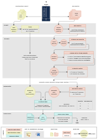

# maldipickr <a href="https://clavellab.github.io/maldipickr"></a>

<!-- badges: start -->

[](https://CRAN.R-project.org/package=maldipickr)
[](https://www.repostatus.org/#active)
[](https://github.com/ClavelLab/maldipickr/actions/workflows/R-CMD-check.yaml)
[](https://app.codecov.io/github/ClavelLab/maldipickr)
<!-- badges: end -->

- You are using the MALDI-TOF[^1] Biotyper to identify bacterial
  isolates
- You want to select representative isolates for further experiments
- You need fast and automated selection decisions that you can retrace

`{maldipickr}` provides documented and tested R functions that will help
you dereplicate MALDI-TOF data and cherry-pick representative spectra of
microbial isolates.

> Check out the graphical overview (click for a bigger version).
> `{maldipickr}` can use two approaches: 
> from taxonomic identification reports (left) or from spectra data (right).
> <a href="https://raw.githubusercontent.com/ClavelLab/maldipickr/main/man/figures/maldipickr-data-flow-portrait.png"></a>

## Installation

`{maldipickr}` is available on the
[CRAN](https://cran.r-project.org/package=maldipickr) and on
[GitHub](https://github.com/ClavelLab/maldipickr).

To install the latest CRAN release, use the following command in R:

``` r
install.packages("maldipickr")
```

Or if you are using [`{renv}`](https://cran.r-project.org/package=renv),
use:

``` r
renv::install("maldipickr")
```

To install the development version, use the following command in R:

``` r
remotes::install_github("ClavelLab/maldipickr", build_vignettes = TRUE)
# or with renv::install("ClavelLab/maldipickr") 
```

## Usage

Start off with the [Introduction to
maldipickr](https://clavellab.github.io/maldipickr/articles/maldipickr.html)
for a quickstart. Otherwise, the comprehensive vignettes will walk you
through the package functions and showcase how to:

1.  [Import spectra data and identification reports from Bruker MALDI
    Biotyper into
    R](https://clavellab.github.io/maldipickr/articles/import-data-from-bruker-maldi-biotyper.html).
2.  [Process, dereplicate and cherry-pick representative spectra, from
    simple to complex
    design](https://clavellab.github.io/maldipickr/articles/dereplicate-bruker-maldi-biotyper-spectra.html).

## Troubleshoot and Contribute

**Troubleshoot** If something unexpected happened when using this
package, please first search the [current open or closed
issues](https://github.com/ClavelLab/maldipickr/issues?q=is%3Aissue++)
to look for similar problems. If you are the first, you are more than
welcome to open a new issue using the “Bug report” template with a
minimal [reprex](https://www.tidyverse.org/help/#reprex).

**Contribute** All contributions are welcome and the
[`CONTRIBUTING.md`](https://clavellab.github.io/maldipickr/CONTRIBUTING.html)
documents how to participate. Please note that the
[`{maldipickr}`](https://github.com/ClavelLab/maldipickr) package is
released with a [Contributor Code of
Conduct](https://clavellab.github.io/maldipickr/CODE_OF_CONDUCT.html).
By contributing to this project, you agree to abide by its terms.

## Credits

**Acknowledgements** This R package is developed for spectra data
generated by the Bruker MALDI Biotyper device. The
[`{maldipickr}`](https://github.com/ClavelLab/maldipickr) package is
built from a suite of Rmarkdown files using the
[`{fusen}`](https://thinkr-open.github.io/fusen/) package by Rochette S
(2023). It relies on:

1.  the [`{MALDIquant}`](https://cran.r-project.org/package=MALDIquant)
    package from Gibb & Strimmer (2012) for spectra functions
2.  the work of Strejcek et al. (2018) for the dereplication procedure.

**Disclaimer** The developers of this package are part of the [Clavel
Lab](https://www.ukaachen.de/kliniken-institute/institut-fuer-medizinische-mikrobiologie/forschung/ag-clavel/)
and are not affiliated with the company Bruker, therefore this package
is independent of the company and is distributed under the [GPL-3.0
License](https://clavellab.github.io/maldipickr/LICENSE.html). The
hexagonal logo was created by Charlie Pauvert and uses the [Atkinson
Hyperlegible
font](https://fonts.google.com/specimen/Atkinson+Hyperlegible/about)
font and a color palette generated at
[coolors.co](https://coolors.co/cf5c36-f0f0c9-555358).

## References

- Gibb S & Strimmer K (2012). “MALDIquant: a versatile R package for the
  analysis of mass spectrometry data”. *Bioinformatics* 28, 2270-2271.
  <https://doi.org/10.1093/bioinformatics/bts447>.
- Rochette S (2023). “fusen: Build a Package from Rmarkdown Files”.
  <https://thinkr-open.github.io/fusen/>,
  <https://github.com/Thinkr-open/fusen>.
- Strejcek M, Smrhova T, Junkova P & Uhlik O (2018). “Whole-Cell
  MALDI-TOF MS versus 16S rRNA Gene Analysis for Identification and
  Dereplication of Recurrent Bacterial Isolates.” *Frontiers in
  Microbiology* 9 <https://doi.org/10.3389/fmicb.2018.01294>.

[^1]: Matrix-Assisted Laser Desorption/Ionization-Time-Of-Flight
    (MALDI-TOF)
